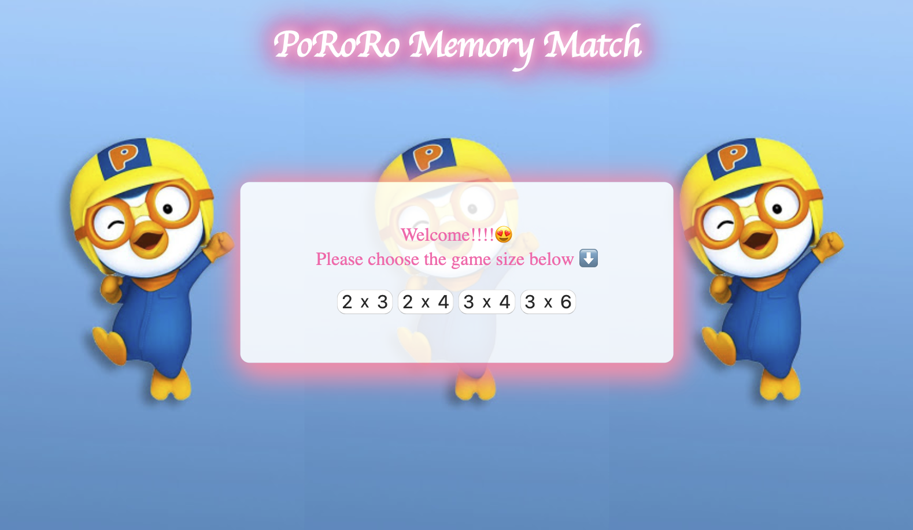

# Pororo Memory Match

## Description
Memory Match is a simple card matching game Pororo carton themed memory match.

## Live Website
Try the application live at http://pororo-memory-match.jinho6225.com/

## Technologies Used
- HTML5
- CSS3
- JavaScript
- AWS EC2

## Features
- User can choose a difficulty
- User can play a game of memory match
- User can see number of games played
- User can see stats
- User can play the same level of game or different difficulty

## Preview


## Development

#### System Requirements
- None

#### Getting Started
1. Clone the repository.
  ```shell
  git clone https://github.com/jinho6225/pororo-memory-match
  cd pororo-memory-match
  ```
2. View the application by opening ```index.html``` in your browser.
